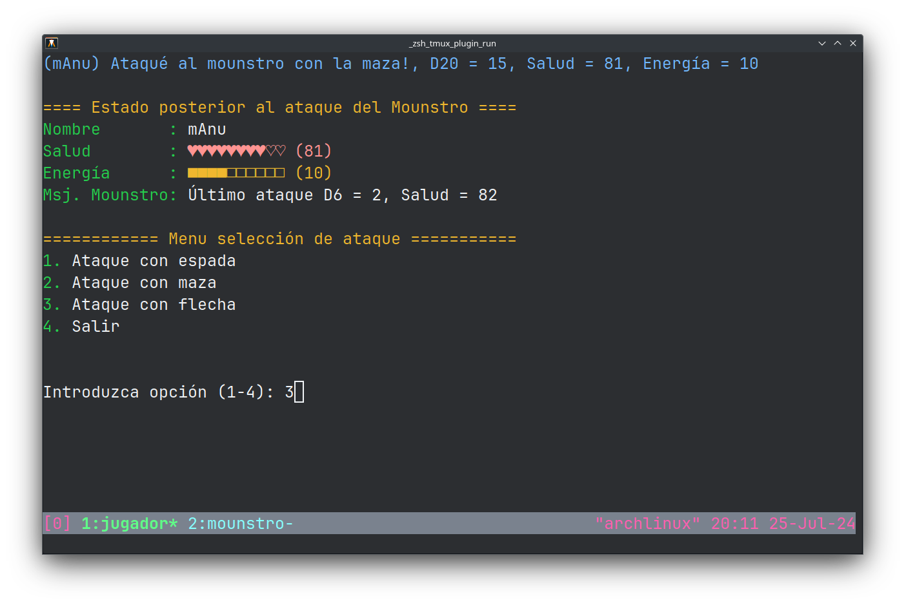
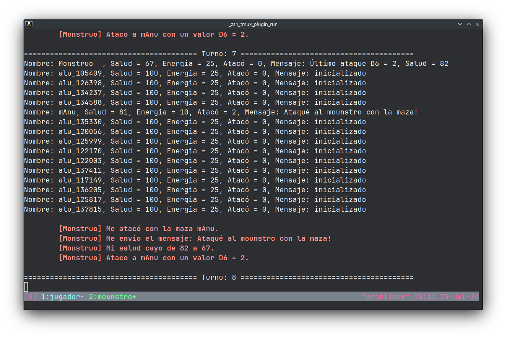
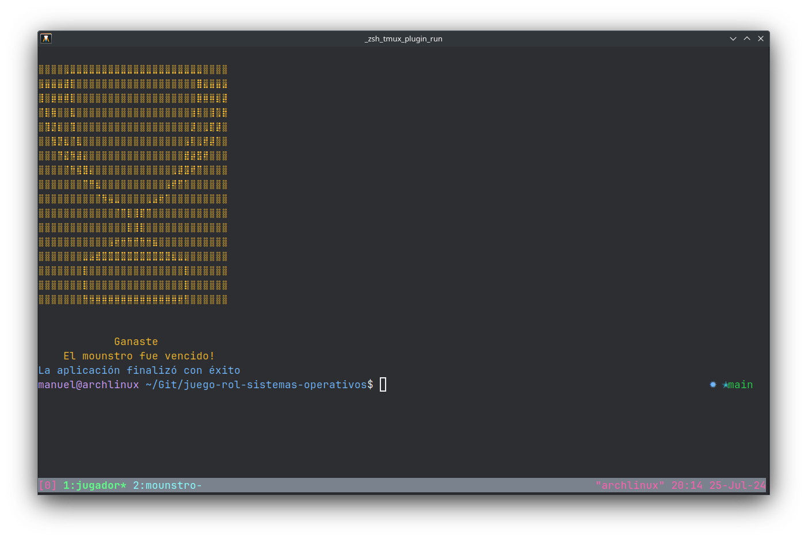
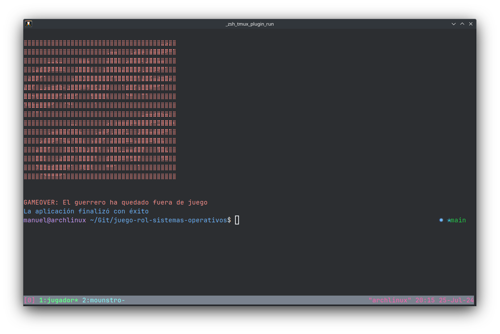

# Juego de Rol Colaborativo Multijugador

Este proyecto es un juego de rol colaborativo multijugador diseñado como parte de un curso de **Sistemas Operativos** en la Universidad Nacional del Sur. En este, cada estudiante debió desarrollar su propio cliente para controlar a su jugador, mientras que el proceso servidor del "monstruo" sería manejado por el profesor. El objetivo fue aprender sobre sincronización entre procesos mediante el uso de memoria compartida y semáforos.

## Descripción del Juego

El juego es un combate colaborativo por turnos basado en texto entre los jugadores y un monstruo. Los jugadores tienen la opción de elegir entre diferentes tipos de ataques (espada, maza, flecha) y deben gestionar su salud y energía para vencer al monstruo. La sincronización entre los clientes (jugadores) y el servidor (monstruo) se realiza mediante memoria compartida y semáforos.

### Características Principales

- **Ataques**: El jugador puede atacar al monstruo con una espada, una maza o una flecha.
- **Gestión de Recursos**: Salud y energía del jugador son gestionadas durante el juego.
- **Sincronización**: Uso de semáforos y memoria compartida para coordinar el acceso a los recursos entre el jugador y el monstruo.

## Requisitos

- **Sistema Operativo**: Compatible con sistemas basados en UNIX (Linux/MacOS).
- **Compilador**: GCC (GNU Compiler Collection).
- **CMake**: Para configurar el proyecto.

## Instalación

1. **Clonar el Repositorio**

   ```bash
   git clone https://github.com/lagosmanuel/juego-rol-sistemas-operativos.git
   cd juego-rol-sistemas-operativos
   ```

2. **Configurar el Proyecto con CMake**

   Crea un directorio de compilación y configura el proyecto:

   ```bash
   mkdir build
   cd build
   cmake ..
   ```

3. **Compilar el Código**

   Una vez configurado el proyecto con CMake, compila el código usando `make`:

   ```bash
   make
   ```

   Esto generará el ejecutable `juego-rol.bin` en el directorio principal del proyecto:
   
   ```bash
   cd ..
   ```

## Ejecución

1. **Iniciar el Servidor**

   El servidor representa al "monstruo" controlado por el profesor. Debe ser ejecutado primero:

   ```bash
   ./server-local.bin
   ```

2. **Iniciar el Cliente**

   Cada estudiante debe ejecutar su propio cliente para controlar a su jugador. Asegúrate de que el servidor esté en ejecución antes de iniciar el cliente:

   ```bash
   ./juego-rol.bin
   ```

   Los clientes se conectarán al servidor y comenzarán la partida.

## Uso

- **Menú del Cliente**: Al ejecutar el cliente, se mostrará un menú con opciones para atacar al monstruo o salir del juego.
- **Opciones**:
  - `1`: Atacar con espada.
  - `2`: Atacar con maza.
  - `3`: Atacar con flecha.
  - `4`: Salir del juego.

- **Mensajes**: Los mensajes sobre el estado del juego y los resultados de los ataques se mostrarán en la consola.

## Sincronización entre Procesos

El juego utiliza semáforos y memoria compartida para sincronizar el acceso entre el cliente y el servidor. Aquí se usan:

- **Memoria Compartida**: Para almacenar el estado del juego, como la salud y la energía del jugador y el monstruo.
- **Semáforos**: Para coordinar el acceso a la memoria compartida y evitar conflictos entre el cliente y el servidor.

## Capturas de Pantalla

Aquí hay algunas capturas de pantalla del juego:

1. **Menú Principal del Cliente**
   

2. **Menu Principal del Servidor**
   

3. **Pantalla de Victoria del Cliente**
   

3. **Pantalla de Derrota del Cliente**
   

## Contribuciones

Este proyecto es parte de un ejercicio académico, no obstante contribuciones adicionales son bienvenidas.

## Licencia

Este proyecto está licenciado bajo la [Licencia Pública General GNU (GPL)](https://www.gnu.org/licenses/gpl-3.0.html). Consulta el archivo [LICENSE](LICENSE) para obtener más detalles.
